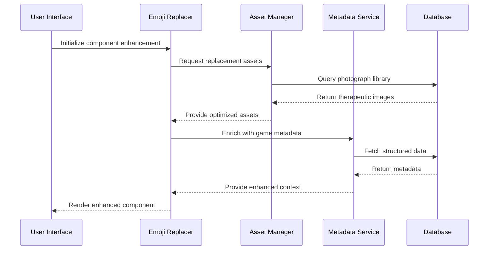

# Design Document: Emoji Removal and UI Enhancement

## Overview

This feature comprehensively removes all emoji/sticker usage from the ASD therapy website and replaces them with real photographs and enhanced UI elements. The current application heavily relies on emojis for visual communication, particularly in the TherapistConsole and SpeechTherapy modules. This design transforms the interface to use professional, therapeutic-appropriate imagery while maintaining accessibility and child-friendly appeal.

## Main Algorithm/Workflow



## Core Interfaces/Types

```typescript
INTERFACE ImageAssetManager
  PROCEDURE getTherapistIcon(role: TherapistRole): ImageAsset
  PROCEDURE getChildActivityIcon(activity: ActivityType): ImageAsset  
  PROCEDURE getMedicalIcon(category: MedicalCategory): ImageAsset
  PROCEDURE preloadAssets(components: ComponentType[]): VOID
END INTERFACE

STRUCTURE ImageAsset
  url: STRING
  altText: STRING
  width: NUMBER
  height: NUMBER
  accessibility: AccessibilityData
  therapeuticContext: TherapeuticMetadata
END STRUCTURE

INTERFACE GameMetadataService
  PROCEDURE getGameMetadata(gameId: STRING): GameMetadata
  PROCEDURE recordSession(session: GameSession): VOID
  PROCEDURE getAnalytics(childId: STRING): AnalyticsData
END INTERFACE

STRUCTURE GameMetadata
  id: STRING
  name: STRING
  therapeuticGoals: ARRAY OF STRING
  difficultyLevel: NUMBER
  evidenceBase: ARRAY OF Reference
  adaptations: ARRAY OF Adaptation
END STRUCTURE
```

## Key Functions with Formal Specifications

### Function 1: replaceEmojiInComponent()

```pascal
PROCEDURE replaceEmojiInComponent(component: ReactComponent, emojiMappings: EmojiMappingTable)
  INPUT: component, emojiMappings
  OUTPUT: enhancedComponent
```

**Preconditions:**
- `component` is a valid React component with emoji usage
- `emojiMappings` contains valid photograph replacements for all emoji types
- Image assets are accessible and optimized for web delivery

**Postconditions:**
- All emoji instances are replaced with appropriate photographs
- Component functionality is preserved
- Accessibility standards are maintained
- Performance is equal or improved

**Loop Invariants:** 
- For emoji scanning loops: All processed emojis have valid replacements
- For replacement loops: Component structure remains intact

### Function 2: validateTherapeuticSuitability()

```pascal
PROCEDURE validateTherapeuticSuitability(asset: ImageAsset): BOOLEAN
  INPUT: asset
  OUTPUT: isValid
```

**Preconditions:**
- `asset` contains valid image metadata
- Therapeutic criteria are defined and accessible
- Accessibility standards are established

**Postconditions:**
- Returns true if and only if asset meets therapeutic standards
- Validation includes cultural sensitivity and age appropriateness
- No side effects on input asset

**Loop Invariants:** N/A (no loops in validation function)

### Function 3: enrichGameWithMetadata()

```pascal
PROCEDURE enrichGameWithMetadata(gameId: STRING, childProfile: ChildProfile): EnrichedGameData
  INPUT: gameId, childProfile
  OUTPUT: enrichedData
```

**Preconditions:**
- `gameId` exists in metadata database
- `childProfile` contains valid therapeutic assessment data
- Metadata service is operational and accessible

**Postconditions:**
- Returns complete game metadata with therapeutic context
- Includes evidence-based adaptations for child's specific needs
- Data collection configuration is properly initialized
- All returned data maintains therapeutic validity

**Loop Invariants:**
- For adaptation loops: Each adaptation is evidence-based and appropriate
- For metadata enrichment: All processed elements maintain validity


## Algorithmic Pseudocode

### Main Emoji Replacement Algorithm

```pascal
ALGORITHM processEmojiReplacement(applicationComponents)
INPUT: applicationComponents of type ARRAY OF ReactComponent
OUTPUT: enhancedComponents of type ARRAY OF ReactComponent

BEGIN
  ASSERT applicationComponents IS NOT EMPTY
  
  // Step 1: Initialize asset management system
  assetManager ← initializeAssetManager()
  emojiMappings ← loadEmojiToPhotoMappings()
  
  // Step 2: Process each component with loop invariant
  enhancedComponents ← EMPTY_ARRAY
  
  FOR each component IN applicationComponents DO
    ASSERT allProcessedComponentsValid(enhancedComponents)
    
    // Scan for emoji usage patterns
    emojiInstances ← scanForEmojis(component)
    
    IF emojiInstances IS NOT EMPTY THEN
      // Replace emojis with photographs
      FOR each emoji IN emojiInstances DO
        photoAsset ← assetManager.getReplacementPhoto(emoji.type, emoji.context)
        
        IF validateTherapeuticSuitability(photoAsset) THEN
          component ← replaceEmojiWithPhoto(component, emoji, photoAsset)
        ELSE
          photoAsset ← getFallbackPhoto(emoji.type)
          component ← replaceEmojiWithPhoto(component, emoji, photoAsset)
        END IF
      END FOR
      
      // Apply enhanced styling
      component ← applyTherapeuticStyling(component)
    END IF
    
    enhancedComponents.add(component)
  END FOR
  
  // Step 3: Validate final results
  ASSERT validateAllComponentsAccessible(enhancedComponents)
  ASSERT validateTherapeuticAppropriate(enhancedComponents)
  
  RETURN enhancedComponents
END
```

**Preconditions:**
- Application components are valid React elements
- Asset management system is properly configured
- Emoji-to-photo mappings are complete and validated
- Therapeutic suitability criteria are defined

**Postconditions:**
- All emoji instances are replaced with appropriate photographs
- Component functionality is preserved across all components
- Accessibility compliance is maintained
- Therapeutic design standards are met

**Loop Invariants:**
- All previously processed components are valid and enhanced
- Emoji replacement maintains component structural integrity
- Therapeutic appropriateness is preserved throughout processing

### Game Metadata Integration Algorithm

```pascal
ALGORITHM integrateGameMetadata(gameSession, metadataService)
INPUT: gameSession of type GameSession, metadataService of type MetadataService
OUTPUT: enrichedSession of type EnrichedGameSession

BEGIN
  ASSERT gameSession IS VALID
  ASSERT metadataService IS AVAILABLE
  
  // Step 1: Retrieve base game metadata
  gameMetadata ← metadataService.getGameMetadata(gameSession.gameId)
  
  IF gameMetadata IS NULL THEN
    THROW GameMetadataNotFoundException(gameSession.gameId)
  END IF
  
  // Step 2: Build therapeutic context
  childProfile ← gameSession.childProfile
  therapeuticNeeds ← analyzeTherapeuticNeeds(childProfile)
  
  // Step 3: Calculate evidence-based adaptations
  availableAdaptations ← gameMetadata.adaptations
  recommendedAdaptations ← EMPTY_ARRAY
  
  FOR each adaptation IN availableAdaptations DO
    ASSERT allRecommendedAdaptationsValid(recommendedAdaptations)
    
    IF isAdaptationAppropriate(adaptation, therapeuticNeeds) THEN
      adaptationConfig ← configureAdaptation(adaptation, childProfile)
      recommendedAdaptations.add(adaptationConfig)
    END IF
  END FOR
  
  // Step 4: Configure data collection framework
  primaryMetrics ← gameMetadata.dataCollection.primaryMetrics
  dataCollectionConfig ← configureDataCollection(primaryMetrics, therapeuticNeeds)
  
  // Step 5: Initialize performance tracking
  performanceTracker ← initializePerformanceTracking(gameMetadata, childProfile)
  
  // Step 6: Create enriched session
  enrichedSession ← createEnrichedSession(
    gameSession,
    gameMetadata,
    recommendedAdaptations,
    dataCollectionConfig,
    performanceTracker
  )
  
  ASSERT validateTherapeuticAlignment(enrichedSession)
  ASSERT validateDataIntegrity(enrichedSession)
  
  RETURN enrichedSession
END
```

**Preconditions:**
- Game session contains valid child profile and game identification
- Metadata service is operational and contains required game data
- Therapeutic adaptation algorithms are properly configured
- Performance tracking systems are available

**Postconditions:**
- Session is enriched with comprehensive therapeutic metadata
- Evidence-based adaptations are properly configured
- Data collection framework is initialized and validated
- Performance tracking is ready for session execution

**Loop Invariants:**
- All recommended adaptations are evidence-based and appropriate
- Therapeutic alignment is maintained throughout enrichment process
- Data integrity is preserved at each processing step

### Asset Validation Algorithm

```pascal
ALGORITHM validateAssetTherapeuticSuitability(asset, therapeuticCriteria)
INPUT: asset of type ImageAsset, therapeuticCriteria of type TherapeuticCriteria
OUTPUT: validationResult of type ValidationResult

BEGIN
  ASSERT asset IS NOT NULL
  ASSERT therapeuticCriteria IS DEFINED
  
  validationResult ← createValidationResult()
  
  // Step 1: Check basic accessibility requirements
  IF asset.altText IS EMPTY OR asset.altText.length < 10 THEN
    validationResult.addError("Insufficient alt text description")
  END IF
  
  IF asset.accessibility.colorContrast < therapeuticCriteria.minimumContrast THEN
    validationResult.addError("Insufficient color contrast for therapeutic use")
  END IF
  
  // Step 2: Validate therapeutic appropriateness
  IF NOT asset.therapeuticContext.ageAppropriate THEN
    validationResult.addError("Image not age-appropriate for target population")
  END IF
  
  IF NOT asset.therapeuticContext.culturallySensitive THEN
    validationResult.addWarning("Image may not be culturally sensitive")
  END IF
  
  // Step 3: Check technical requirements
  IF asset.dimensions.width < therapeuticCriteria.minimumWidth OR 
     asset.dimensions.height < therapeuticCriteria.minimumHeight THEN
    validationResult.addError("Image dimensions below therapeutic minimum")
  END IF
  
  // Step 4: Validate licensing and usage rights
  IF NOT hasValidLicense(asset.metadata.license) THEN
    validationResult.addError("Invalid or missing usage license")
  END IF
  
  // Step 5: Determine overall suitability
  IF validationResult.hasErrors() THEN
    validationResult.suitable ← FALSE
  ELSE
    validationResult.suitable ← TRUE
  END IF
  
  RETURN validationResult
END
```

**Preconditions:**
- Asset contains complete metadata including accessibility information
- Therapeutic criteria are properly defined and accessible
- Licensing validation system is operational

**Postconditions:**
- Validation result indicates suitability for therapeutic use
- All validation errors and warnings are properly documented
- Licensing compliance is verified
- Technical requirements are validated

**Loop Invariants:** N/A (no loops in this validation algorithm)

## Key Functions with Formal Specifications

### Function 1: mapEmojiToPhotograph()

```typescript
function mapEmojiToPhotograph(emojiType: EmojiType, context: TherapeuticContext): Promise<ImageAsset>
```

**Preconditions:**
- `emojiType` is a valid emoji category from the existing codebase
- `context` contains therapeutic appropriateness criteria
- Image asset database is accessible and populated

**Postconditions:**
- Returns appropriate photograph asset for the emoji type
- Returned asset meets therapeutic design guidelines
- Asset includes proper accessibility metadata
- Image is optimized for web delivery

**Loop Invariants:** N/A (no loops in this function)

### Function 2: validateTherapeuticSuitability()

```typescript
function validateTherapeuticSuitability(asset: ImageAsset): boolean
```

**Preconditions:**
- `asset` is a valid ImageAsset object
- Therapeutic suitability criteria are defined
- Accessibility standards are established

**Postconditions:**
- Returns boolean indicating suitability for therapeutic context
- `true` if and only if asset meets all therapeutic criteria
- Validation includes cultural sensitivity and age appropriateness

**Loop Invariants:** N/A (no loops in this function)

### Function 3: enrichGameWithMetadata()

```typescript
function enrichGameWithMetadata(gameId: string, childProfile: ChildProfile): Promise<EnrichedGameData>
```

**Preconditions:**
- `gameId` corresponds to existing game in metadata database
- `childProfile` contains valid therapeutic assessment data
- Metadata service is operational

**Postconditions:**
- Returns enriched game data with therapeutic context
- Includes evidence-based adaptations for child's needs
- Contains structured data collection configuration
- Maintains data integrity and therapeutic alignment

**Loop Invariants:**
- For metadata enrichment loops: All processed elements maintain therapeutic validity
- For adaptation loops: Each adaptation is evidence-based and appropriate

## Example Usage

```typescript
// Example 1: Enhanced TherapistConsole component
SEQUENCE
  assetManager ← initializeImageAssetManager()
  
  // Replace emoji-heavy header
  therapistIcon ← assetManager.getTherapistIcon("medical-professional")
  headerComponent ← createEnhancedHeader(therapistIcon, "Therapist Console")
  
  // Replace stat card emojis with professional photos
  childrenIcon ← assetManager.getChildActivityIcon("patient-care")
  sessionsIcon ← assetManager.getMedicalIcon("session-management")
  completedIcon ← assetManager.getUIIcon("success-indicator")
  accuracyIcon ← assetManager.getUIIcon("performance-metric")
  
  statsGrid ← createStatsGrid([
    createStatCard(childrenIcon, "Total Children", stats.total_children),
    createStatCard(sessionsIcon, "Total Sessions", stats.total_sessions),
    createStatCard(completedIcon, "Completed", stats.completed_sessions),
    createStatCard(accuracyIcon, "Weekly Accuracy", stats.weekly_accuracy)
  ])
  
  enhancedConsole ← combineComponents(headerComponent, statsGrid)
END SEQUENCE

// Example 2: Enhanced SpeechTherapy interface
SEQUENCE
  metadataService ← initializeGameMetadataService()
  
  // Get enriched activity metadata
  activities ← [
    { type: "repetition", name: "Repetition Practice" },
    { type: "picture_naming", name: "Picture Naming" },
    { type: "questions", name: "Question & Answer" }
  ]
  
  FOR each activity IN activities DO
    metadata ← metadataService.getActivityMetadata(activity.type)
    activityIcon ← assetManager.getChildActivityIcon(activity.type)
    activity.enhancedData ← combineActivityData(metadata, activityIcon)
  END FOR
  
  // Replace recording interface emojis
  microphoneIcon ← assetManager.getUIIcon("professional-microphone")
  recordingInterface ← createRecordingInterface(microphoneIcon)
  
  enhancedSpeechTherapy ← createSpeechTherapyInterface(activities, recordingInterface)
END SEQUENCE

// Example 3: Game metadata integration workflow
SEQUENCE
  gameId ← "speech-repetition-001"
  childProfile ← getCurrentChildProfile()
  
  // Create enriched game session
  baseSession ← createGameSession(gameId, childProfile.id)
  enrichedSession ← enrichGameWithMetadata(baseSession, metadataService)
  
  // Apply therapeutic adaptations
  IF childProfile.needsVisualSupports THEN
    enrichedSession ← addVisualSupports(enrichedSession)
  END IF
  
  IF childProfile.needsExtendedTime THEN
    enrichedSession ← extendResponseTime(enrichedSession)
  END IF
  
  // Initialize performance tracking
  performanceTracker ← initializeTracking(enrichedSession.metadata.primaryMetrics)
  
  // Start enhanced therapy session
  startTherapySession(enrichedSession, performanceTracker)
END SEQUENCE
```

## Correctness Properties

*A property is a characteristic or behavior that should hold true across all valid executions of a system-essentially, a formal statement about what the system should do. Properties serve as the bridge between human-readable specifications and machine-verifiable correctness guarantees.*

### Property 1: Complete Emoji Elimination

*For any* React component processed by the Emoji_Replacer, the Enhanced_Component should contain zero emoji instances while maintaining all original functionality

**Validates: Requirements 1.1, 1.2, 1.4**

### Property 2: Component Functionality Preservation

*For any* React component that undergoes emoji replacement, the Enhanced_Component should preserve identical behavior, event handlers, state management, and parent component compatibility

**Validates: Requirements 1.3, 8.1, 8.2, 8.3, 8.4, 8.5**

### Property 3: Therapeutic Asset Validation

*For any* Image_Asset provided by the Asset_Manager, the asset should meet comprehensive therapeutic suitability criteria including age appropriateness, cultural sensitivity, and licensing requirements

**Validates: Requirements 2.1, 2.2, 2.3, 2.5, 9.1, 9.2**

### Property 4: Accessibility Compliance

*For any* Enhanced_Component, the component should provide adequate alt text, maintain color contrast standards, support screen readers, and preserve keyboard navigation

**Validates: Requirements 4.1, 4.2, 4.3, 4.5**

### Property 5: Graceful Error Handling

*For any* system failure (asset loading, validation, or processing), the system should provide appropriate fallbacks while maintaining therapeutic functionality and never disrupting active sessions

**Validates: Requirements 2.4, 10.1, 10.3, 10.5**

### Property 6: Performance Preservation

*For any* component processing operation, the system should maintain or improve performance metrics through asset preloading, optimization, and efficient replacement algorithms

**Validates: Requirements 5.1, 5.2, 5.3, 5.4**

### Property 7: Comprehensive Metadata Integration

*For any* game session or activity, the Metadata_Service should provide complete therapeutic context, evidence-based adaptations, and maintain alignment throughout processing

**Validates: Requirements 3.1, 3.2, 3.3, 3.5**

### Property 8: Comprehensive Data Collection

*For any* therapeutic session, the system should initialize tracking, record adaptations, persist session data, and provide correlation analytics between enhancements and outcomes

**Validates: Requirements 7.1, 7.2, 7.3, 7.4**

### Property 9: SpeechTherapy Interface Enhancement

*For any* SpeechTherapy component interaction, the system should replace emojis with professional therapeutic imagery and provide comprehensive metadata context

**Validates: Requirements 6.1, 6.2, 6.3, 6.4, 6.5**

### Property 10: Therapeutic Validation Round Trip

*For any* asset that passes therapeutic validation, re-validating the same asset should produce consistent results and maintain audit trail integrity

**Validates: Requirements 9.3, 9.4, 9.5**

### Property 11: Audit Trail Completeness

*For any* validation or error event, the system should log detailed information sufficient for clinical compliance review

**Validates: Requirements 9.4, 10.4**

